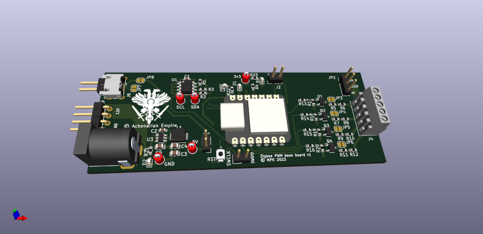

View this project on [CADLAB.io](https://cadlab.io/project/26827). 

# Zigbee LED Controller

A simple carrier card for driving some LEDs via PWM. Hosts an off the ZigBee module.

* Runs from 5V
* Derives 3v3 from 5V
* Has optional 12V rail for the PWM
* 4 channel, RGB+W low-side PWM

